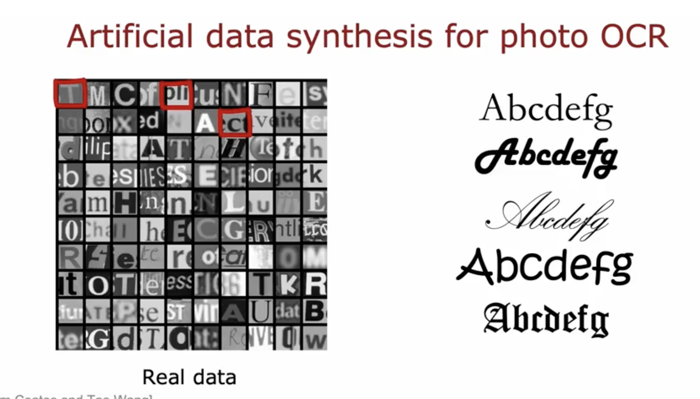

## for data augmentation 

- diostortion should be representation of the type of noise/distortions in the test set
- bgd noise, bad cellphones connections 
- its not helpful to add purely random/meaningless noise

## 也可以自己加synthesised data

## transfer learning

use less output units 

ini using the first couple of weights and bias 
they start at a better place, and will need less further learning to reach good

- supervised pretrainiing (not quite related, but widely posted online)

- fintuning (i can do it myself)

### why does it work?

### precedures

## full cycle of ML project

-eg speech recog

### deployment 

### ethical guidelines

### treating bias in a rare disease case

a dumb algo printing could do better

but its not useful.... not a learning algo

